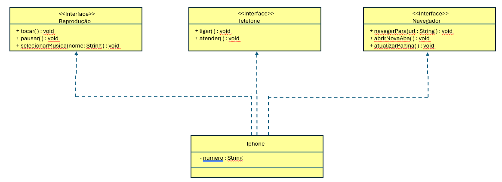

# Iphone_UML
Modelando principais funcionalidades de um Iphone com UML e Java baseado no Vìdeo de lançamento de 2007:  https://www.youtube.com/watch?v=B43OhyT_Kb4

- Realizado criação básica de uml, apenas para ilustrar, e implementação de classes e interfaces.

- Construído de forma simples apenas para demonstrar a possibilidade de obter classes que representam rescursos direfentes através da implementação de suas interfaces.

